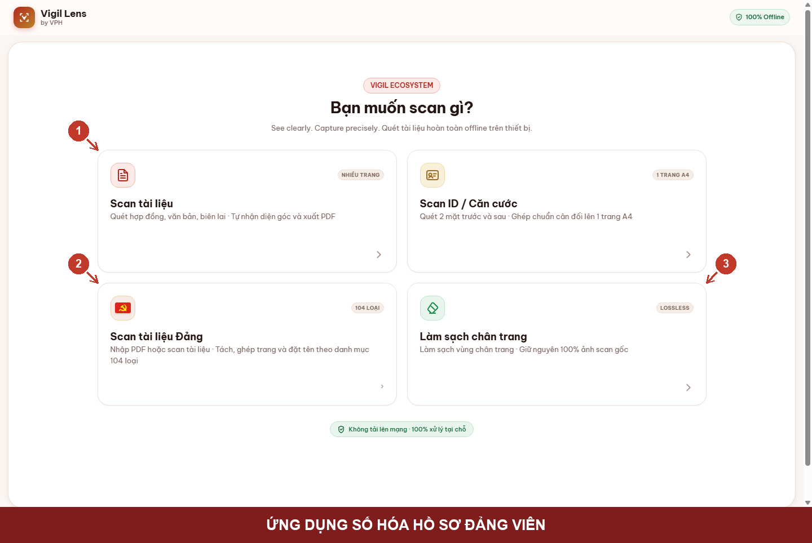
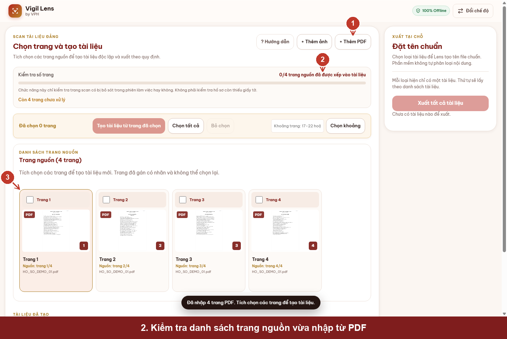
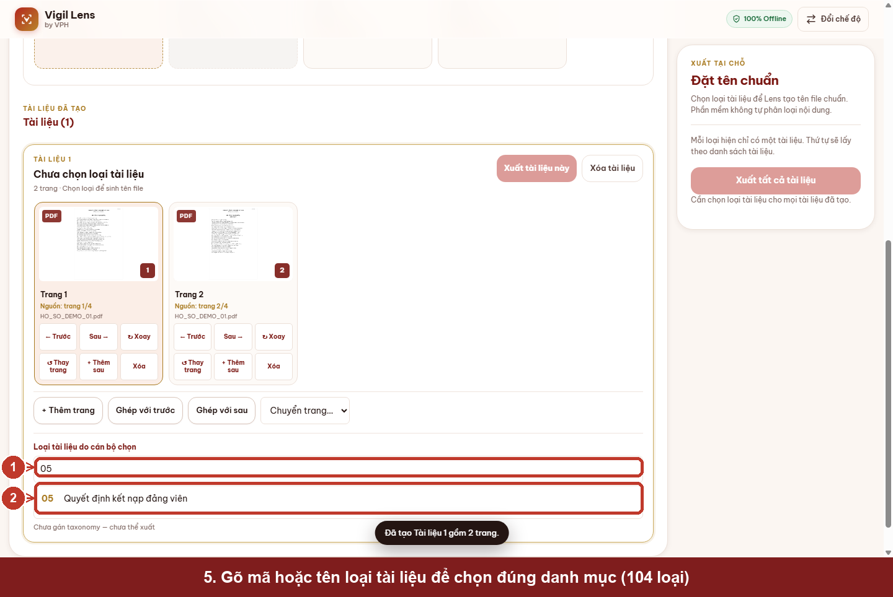
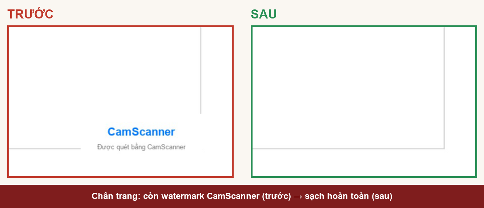

# GIỚI THIỆU SẢN PHẨM — VIGIL LENS

> Tài liệu giới thiệu sản phẩm, dùng cho báo cáo sáng kiến / thuyết minh / trình chiếu.
> Ảnh minh hoạ dùng dữ liệu mẫu (demo), không phải hồ sơ Đảng viên thật.

---

## 1. Bài toán thực tế

Công tác số hóa hồ sơ, giấy tờ tại đơn vị hiện nay còn nhiều thao tác thủ công:

- Ảnh chụp tài liệu bằng điện thoại thường bị nghiêng, méo phối cảnh, cần chỉnh sửa lại trước khi
  lưu trữ hoặc in ấn.
- Hồ sơ nhiều trang (được scan gộp thành một file PDF dài) cần được **tách** đúng theo từng loại
  tài liệu và **đặt tên file** theo danh mục quy định — công việc lặp lại, dễ nhầm lẫn nếu làm tay.
- Nhiều tài liệu đã scan trước đây bằng ứng dụng di động (ví dụ CamScanner) còn để lại một dải
  watermark nhỏ ở chân trang, ảnh hưởng đến tính chuẩn mực của hồ sơ lưu trữ.
- Yêu cầu bảo mật đặt ra: hồ sơ, giấy tờ **không được phép tải lên** bất kỳ dịch vụ đám mây hay
  máy chủ bên thứ ba nào trong quá trình xử lý.

## 2. Giải pháp

**Vigil Lens** là công cụ số hóa tài liệu chạy hoàn toàn trên thiết bị (trình duyệt), giải quyết
đồng thời cả bốn nhu cầu trên trong một ứng dụng duy nhất:

$$\text{Chụp/Nhập} \longrightarrow \text{Nhận diện} \longrightarrow \text{Sửa/Tách/Ghép} \longrightarrow \text{Xuất PDF}$$

Không máy chủ · Không tài khoản · Không OCR · Không gửi tài liệu đi bất cứ đâu.

## 3. Scan và xử lý hồ sơ Đảng

Chế độ **Scan tài liệu Đảng** cho phép cán bộ nhập PDF hoặc ảnh đã scan, xem trước từng trang, chủ
động tách một tập tin nhiều trang thành nhiều tài liệu độc lập, gán loại tài liệu theo danh mục
chuẩn 104 loại, và xuất từng tài liệu ra PDF với tên file được sinh tự động theo đúng danh mục.

| Nhập nguồn & kiểm tra trang | Tách trang & gán loại tài liệu |
|---|---|
|  |  |

Cán bộ luôn giữ toàn quyền kiểm soát: phần mềm không tự động phân loại nội dung tài liệu, không
OCR, không suy đoán hồ sơ còn thiếu giấy tờ gì.

## 4. Làm sạch tài liệu scan

Chế độ **Làm sạch chân trang** bóc tách watermark của phần mềm scan khác (CamScanner…) khỏi PDF đã
scan trước đó, bằng cách can thiệp trực tiếp cấu trúc file PDF — không nén lại ảnh. Nhờ vậy, nội
dung tài liệu chính giữ nguyên 100% chất lượng gốc (bit-for-bit lossless), chỉ vùng watermark thừa
bị loại bỏ.

## 5. Kết quả trước / sau

Toàn bộ quá trình xử lý chỉ mất vài mili-giây ngay trên trình duyệt, không cần chờ tải lên/tải
xuống qua mạng.

## 6. Giá trị trong thực tế sử dụng

- **Giảm thao tác thủ công:** tự động nhận diện góc giấy, sửa phối cảnh, đặt tên file theo danh
  mục — cán bộ chỉ cần xác nhận thay vì làm lại từ đầu.
- **Chuẩn hóa hồ sơ lưu trữ:** tên file và cách tách/ghép tài liệu theo đúng danh mục quy định,
  giảm sai sót khi bàn giao hoặc tra cứu lại.
- **An toàn dữ liệu:** không backend, không tài khoản, không lưu trữ lâu dài, không gửi tài liệu ra
  khỏi thiết bị — phù hợp với yêu cầu bảo mật hồ sơ nội bộ.
- **Dùng được ngay, không cần hạ tầng:** chạy trực tiếp trong trình duyệt trên máy tính hoặc điện
  thoại, không cần cài đặt phần mềm nặng hay đăng ký tài khoản.
