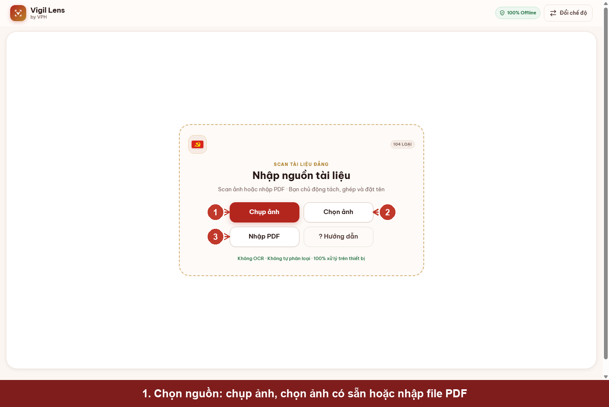
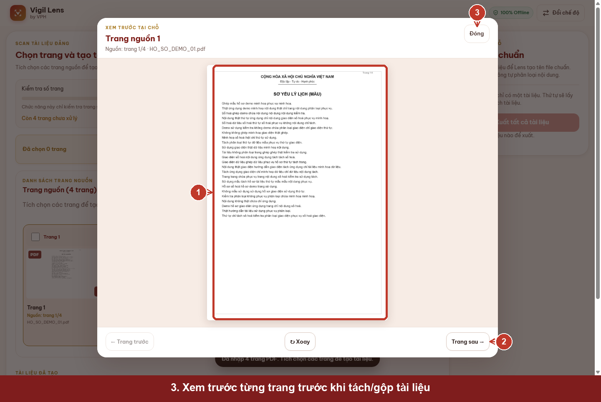
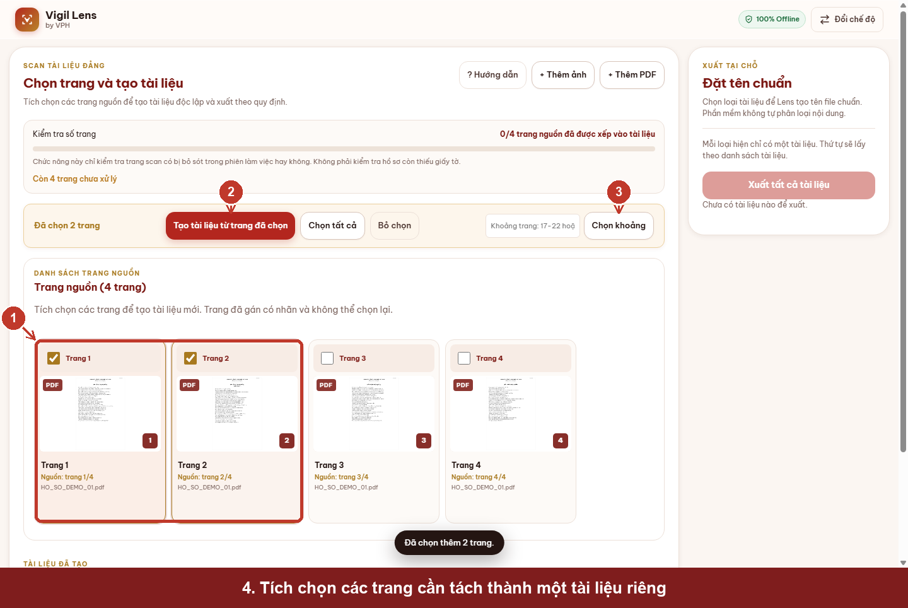
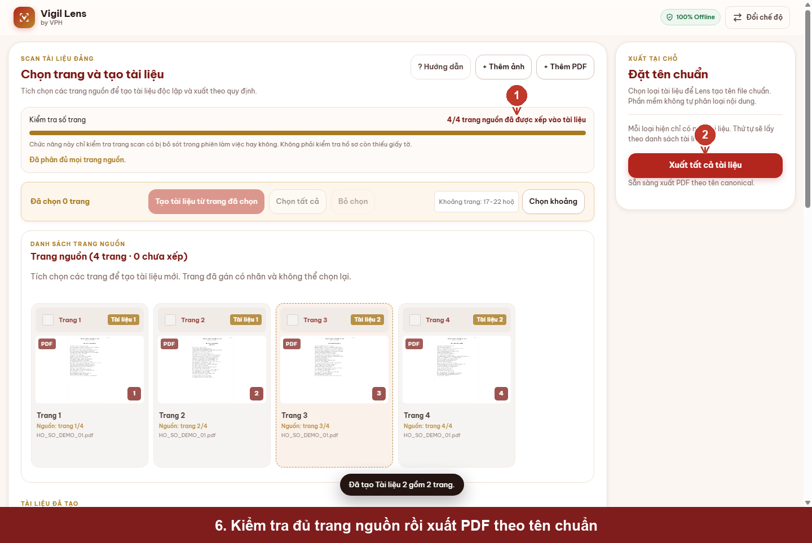
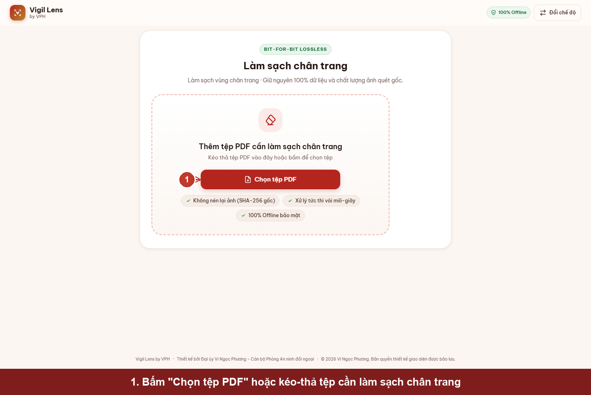
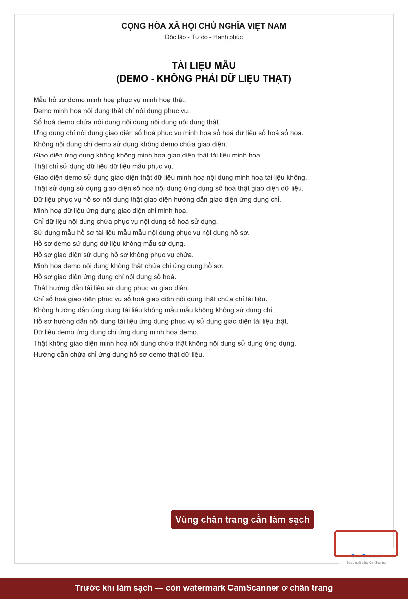
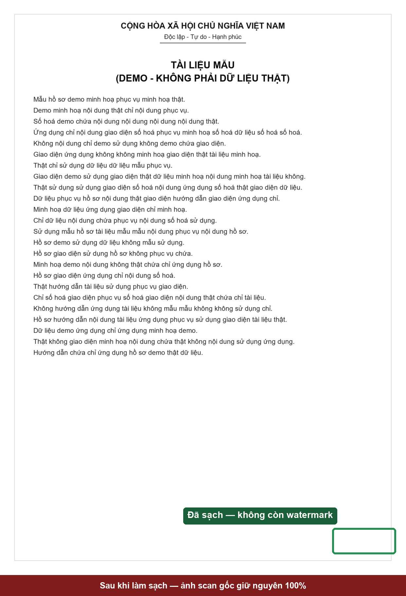
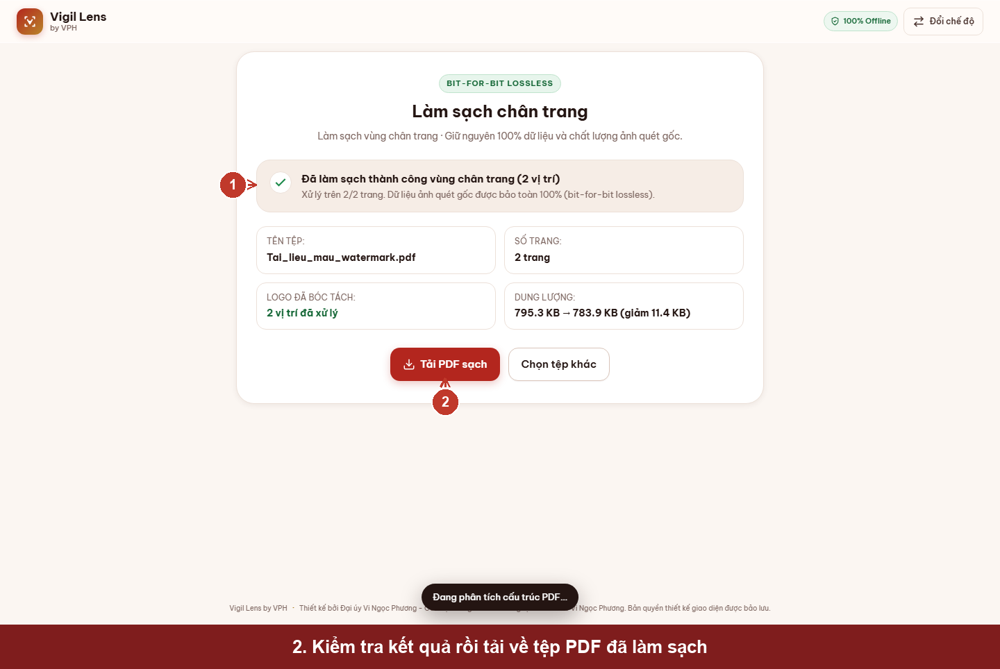

# ỨNG DỤNG SỐ HÓA HỒ SƠ ĐẢNG VIÊN

> Hướng dẫn sử dụng — Vigil Lens (VPH Vigil Lens)
> Ảnh minh hoạ dùng dữ liệu mẫu (demo), không phải hồ sơ Đảng viên thật.

---

## 1. Giới thiệu

**Vigil Lens** là công cụ hỗ trợ số hóa hồ sơ, giấy tờ ngay trên thiết bị của cán bộ — không cần
cài đặt phần mềm nặng, không cần tài khoản, không cần kết nối mạng. Toàn bộ quá trình xử lý ảnh,
nhận diện góc giấy, sửa phối cảnh và xuất file PDF đều chạy cục bộ trong trình duyệt; tài liệu
không được tải lên bất kỳ máy chủ nào.

Ứng dụng giúp giảm bớt các thao tác thủ công khi xử lý tài liệu scan: tự động nhận diện 4 góc tờ
giấy, sửa nghiêng/phối cảnh, tách — ghép trang theo từng loại hồ sơ, và làm sạch phần chân trang
còn sót lại logo phần mềm scan khác (ví dụ CamScanner) mà không làm giảm chất lượng ảnh gốc.

---

## 2. Các chức năng chính

### 2.1 Quản lý hồ sơ

Màn hình chính là nơi chọn một trong bốn chế độ làm việc độc lập. Mỗi phiên làm việc chỉ tồn tại
trong bộ nhớ tạm (RAM) của trình duyệt — đóng tab là toàn bộ dữ liệu biến mất, không có gì được
lưu lại trên máy hay trên mạng.

### 2.2 Scan tài liệu Đảng

Nhập ảnh hoặc file PDF hồ sơ đã scan, xem trước từng trang, chủ động tách/ghép trang thành nhiều
tài liệu độc lập, gán loại tài liệu theo danh mục chuẩn 104 loại, rồi xuất từng tài liệu ra PDF
với tên file được đặt tự động theo danh mục. Phần mềm **không tự động phân loại nội dung** — cán
bộ luôn là người quyết định trang nào thuộc tài liệu nào và loại tài liệu gì.

### 2.3 Xử lý PDF

Trang nguồn dạng PDF được import trực tiếp — nếu không phải tách ảnh mới, hệ thống copy nguyên
trang PDF gốc (không chuyển đổi lại thành ảnh) khi xuất, giữ được chất lượng và dung lượng tối ưu.

### 2.4 Làm sạch chân trang

Chế độ riêng dành cho việc bóc tách logo/watermark của phần mềm scan khác (ví dụ CamScanner) khỏi
vùng chân trang của PDF đã scan trước đó. Xử lý bằng cách can thiệp trực tiếp cấu trúc PDF (không
nén lại ảnh), nên ảnh tài liệu chính giữ nguyên 100% chất lượng gốc (bit-for-bit lossless).

---

## 3. Hướng dẫn Scan tài liệu Đảng

### Bước 1 — Chọn nguồn tài liệu

Từ trang chính, bấm vào thẻ **"Scan tài liệu Đảng"**, sau đó chọn một trong ba nguồn: chụp ảnh
trực tiếp, chọn ảnh có sẵn, hoặc nhập file PDF đã scan.

### Bước 2 — Kiểm tra danh sách trang nguồn

Sau khi nhập, toàn bộ trang nguồn hiển thị dạng thumbnail kèm số thứ tự và tên file gốc. Thanh
**"Kiểm tra số trang"** cho biết đã có bao nhiêu trang được xếp vào tài liệu — chỉ là công cụ đối
chiếu số lượng trang trong phiên làm việc, không phải kiểm tra hồ sơ có đủ loại giấy tờ hay không.

### Bước 3 — Xem trước từng trang

Bấm vào thumbnail bất kỳ để mở cửa sổ xem trước cỡ lớn, kiểm tra độ nét và nội dung trước khi
quyết định tách trang. Có thể chuyển trang tiếp/trước hoặc xoay ngay trong cửa sổ xem trước.

### Bước 4 — Chọn trang cần tách thành tài liệu riêng

Tích chọn từng trang, hoặc nhập khoảng trang (ví dụ `1-2`) rồi bấm **"Chọn khoảng"** để chọn
nhanh. Sau khi chọn xong, bấm **"Tạo tài liệu từ trang đã chọn"** để tách các trang đó thành một
tài liệu độc lập — các tài liệu khác trong cùng phiên làm việc không bị ảnh hưởng.

### Bước 5 — Gán loại tài liệu

Mỗi tài liệu vừa tạo cần được gán **loại tài liệu** theo danh mục chuẩn 104 loại. Gõ mã số hoặc
tên loại (có hỗ trợ tìm không dấu) vào ô nhập, phần mềm sẽ gợi ý danh sách khớp để chọn. Tên file
PDF khi xuất được sinh tự động theo đúng danh mục đã chọn — cán bộ không cần tự đặt tên file.

### Bước 6 — Kiểm tra và xuất PDF

Khi mọi trang nguồn đã được xếp vào tài liệu (thanh tiến trình báo đủ 100%) và mọi tài liệu đã có
loại, nút **"Xuất tất cả tài liệu"** sẽ sáng lên. Bấm để xuất toàn bộ tài liệu ra PDF cùng lúc,
mỗi tài liệu một file với tên chuẩn theo danh mục.

> **Lưu ý:** nếu có nhiều tài liệu cùng một loại, phần mềm sẽ yêu cầu xác nhận thứ tự để đặt hậu
> tố `.1`, `.2`... trước khi cho phép xuất.

---

## 4. Hướng dẫn làm sạch chân trang

### Bước 1 — Chọn tệp PDF cần xử lý

Từ trang chính, chọn thẻ **"Làm sạch chân trang"**, sau đó bấm **"Chọn tệp PDF"** hoặc kéo-thả
trực tiếp file PDF đã scan cần xử lý vào khung.

### Trước khi làm sạch

Nhiều tài liệu scan bằng ứng dụng di động (như CamScanner) để lại một dải watermark nhỏ ở chân
trang, ngay cả ở bản đã xuất. Đây là ví dụ một trang tài liệu mẫu còn watermark ở góc dưới bên
phải:

### Sau khi làm sạch

Sau khi xử lý, vùng chân trang được loại bỏ hoàn toàn — trong khi toàn bộ nội dung ảnh scan chính
(phần văn bản/chữ ký/con dấu) giữ nguyên 100% dữ liệu gốc, không bị nén lại hay giảm độ nét:

### Bước 2 — Kiểm tra kết quả và tải về

Ngay sau khi xử lý xong (chỉ mất vài mili-giây), phần mềm hiển thị kết quả: số vị trí watermark đã
xử lý, số trang bị ảnh hưởng, và dung lượng file trước/sau. Bấm **"Tải PDF sạch"** để lưu file kết
quả về máy.

> **Lưu ý:** nếu tài liệu không có watermark hoặc đã là file sạch, phần mềm sẽ báo "Vùng chân
> trang đã sạch" và giữ nguyên vẹn 100% file gốc — không có gì bị thay đổi.

---

## 5. Lưu ý khi sử dụng

- **Không cần mạng:** ứng dụng hoạt động hoàn toàn ngoại tuyến sau khi trang đã tải xong một lần.
  Không có bước nào gửi ảnh hay file PDF ra khỏi máy.
- **Không lưu trữ lâu dài:** đóng tab hoặc tải lại trang là toàn bộ tài liệu trong phiên làm việc
  biến mất. Hãy xuất và lưu file PDF trước khi đóng ứng dụng.
- **Phần mềm không tự phân loại nội dung:** việc chọn trang nào thuộc tài liệu nào, và tài liệu đó
  là loại gì, luôn do cán bộ quyết định — phần mềm chỉ hỗ trợ thao tác và đặt tên file.
- **Kiểm tra kỹ trước khi xuất:** nên xem trước từng trang (Bước 3, mục 3) để chắc chắn đúng thứ
  tự và không nhầm trang trước khi tạo tài liệu.
- **Làm sạch chân trang là thao tác lossless:** ảnh scan chính không bị nén lại; nếu file không có
  watermark, file gốc được giữ nguyên vẹn tuyệt đối.
